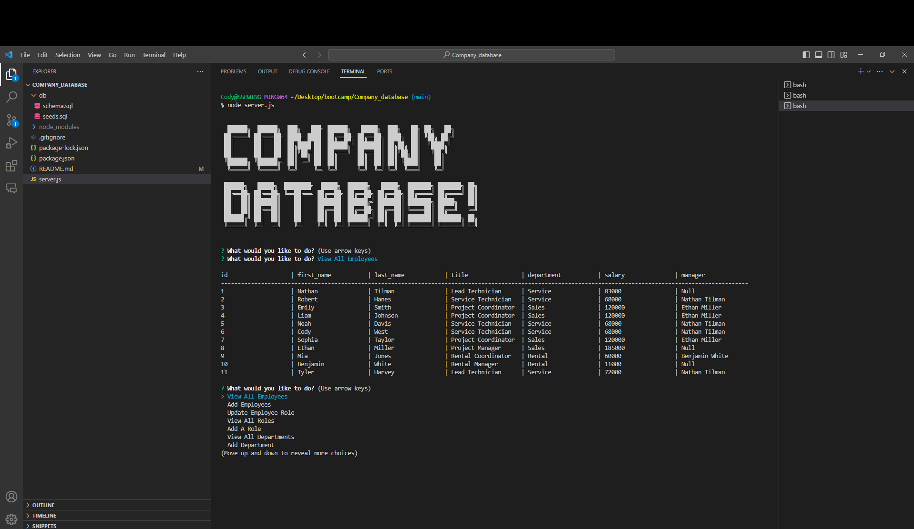
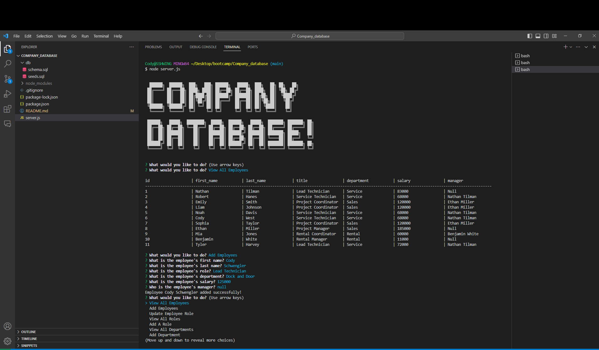
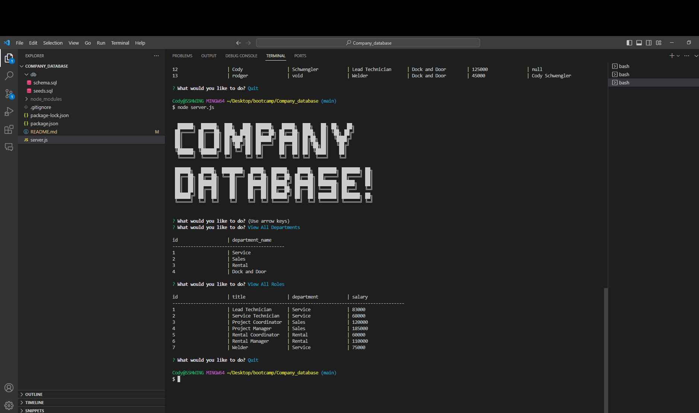

# Company_database

# Video link for Application:
https://drive.google.com/file/d/1ginqLhwwCCYsTodbuobH7kVW0NLuXsyd/view

# Project Description:
This Project is designed to create a employee database for a company. With this database we can view employees, departments, and roles. We can add an employee, a new role, and a new department to the database.

To start the project, open the terminal. Once open enter your mysql username and password. Once you are in mysql SOURCE db/schema.sql, when database is effected SOURCE db/seeds.sql. Quit mysql as the database has been uploaded. Type node server into the terminal. The Company Database will be displayed asking you a list of questions. If you pick a (view) question it will display the table for that question. If you choose the add or update questions it will ask you a series of questions and use that input to enter the correct infromation into the correct table within the database.

# Javascript File:
Started with no starter code for server.js. started by installing all npm's that i needed such as inquirer, mysql2, and cfonts. created a main function that loops through the assorted questions. Created functions for each question asked within the main loop. When user is done they simple need to click enter on the quit answer within the main function.

# DB Folder:
created sql files schema and seeds. Schema files is where the database is created with tables to represent the company. Seeds is used to seed the data into the correct table within the database.

# Github:
Pushed out DB files, Javascript, and README when finishing any coding edits, as to ensure I could go back at anytime to earlier designs if need be.

# Project is located at this URL:
https://github.com/Rounderr21/Company_database

Screenshot of the Project:

